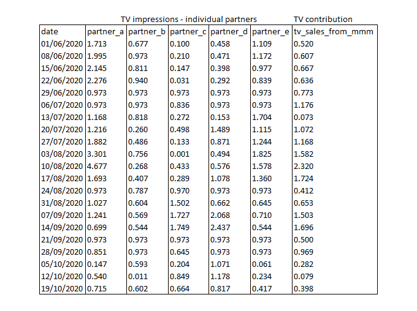
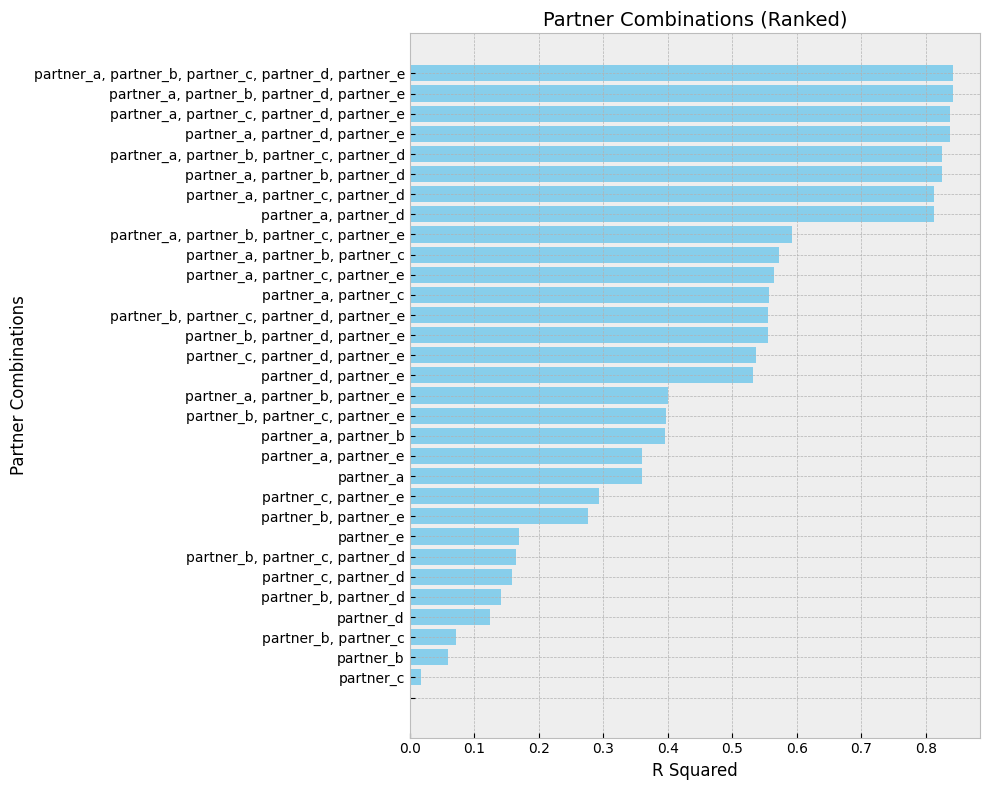

# Sub-Channel Marketing Performance Analysis Tool

This tool applies Shapley Value Regression to dissect marketing performance at the granular level of individual channel partners, enhancing the broader insights gained from traditional Marketing Mix Modeling (MMM). It's designed to pinpoint the distinct influence each partner has within a channel.

## How to Use

Follow these steps to conduct your analysis:

1. Format your data according to the structure in the provided Excel template (`channel_partner_v1.xlsx`).
2. Launch the Jupyter notebook included in this repository.
3. Update the `path` and `sheet_name` in the `read_data` function to correspond to your Excel file.
4. Run the notebook cells consecutively to perform the analysis.

## Understanding the Methodology

Shapley Value Regression is at the core of this tool, measuring each channel partner's marginal contribution to marketing success. It examines all permutations of partner combinations to quantify their individual impacts.

Input data should be time-series, organized in an Excel spreadsheet with the date (by week) as the first column, followed by independent variables, and concluding with the dependent variable (sales) in the last column. We utilize fundamental Python packages for the regression and subsequent coefficient calculation. It's important to distinguish this approach from other libraries like SHAP, which are typically used for variable importance in machine learning models.

## Interpreting Results

The output comprises R-squared (R²) values and Shapley Value adjusted coefficients from linear regression analyses. These metrics measure the extent of sales variability explained by the marketing partners' efforts and their weighted contribution, respectively. Such insights afford a deeper understanding of each partner's impact on sales.

Shapley Value Regression is a potent approach for elucidating performance at the partner level within marketing channels, deftly handling multicollinearity to provide clear-cut contribution metrics.

This code is inspired by the following research:

Tang, S., Musunuru, S., Zong, B. and Thornton, B., 2024. Quantifying Marketing Performance at Channel-Partner Level by Using Marketing Mix Modeling (MMM) and Shapley Value Regression. arXiv preprint arXiv:2401.05653.

## Sample Data Input

## Sample Analysis Output

